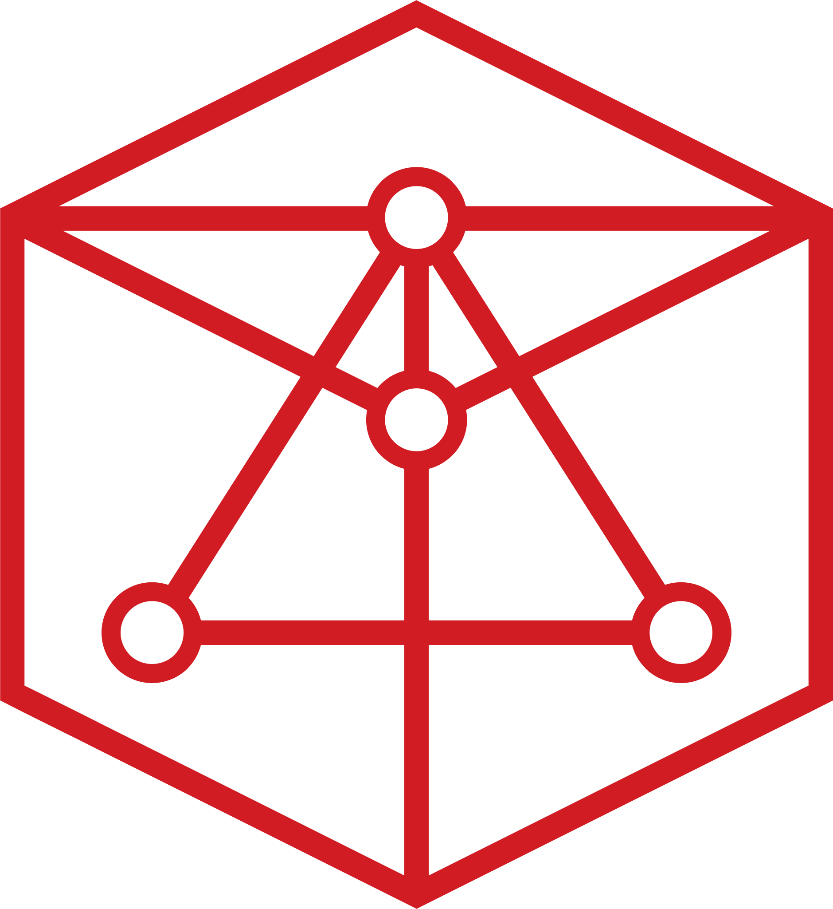

# design

All design materials related with evilfactory

## Typography

- [Merriweather](https://fonts.google.com/specimen/Merriweather) for Serif
- [Inter](https://rsms.me/inter/) for Sans Serif
- [Space Mono](https://fonts.google.com/specimen/Space+Mono) for Monospace

### Merriweather

### Inter

### Space Mono

## Colors

Currently we are using 8 colors kind

### Red (#E53A40) [accessibility problem]

### Red Darker (#D01C22)

### Navy (#001B44)

### Black Lighter (#333333)

### Black (#000000)

### Silver (#EEEEEE)

### Gray (#DDDDDD)

## Logo

Our logo was designed by [@ri7nz](https://github.com/ri7nz) and digitalized
(and explored) by [@mirzazulfan](https://github.com/mirzazulfan).

We have so many logo variants, take a look to [this repo](https://github.com/evilfactory/design/tree/master/logo/guidelines) for logo guidelines.

